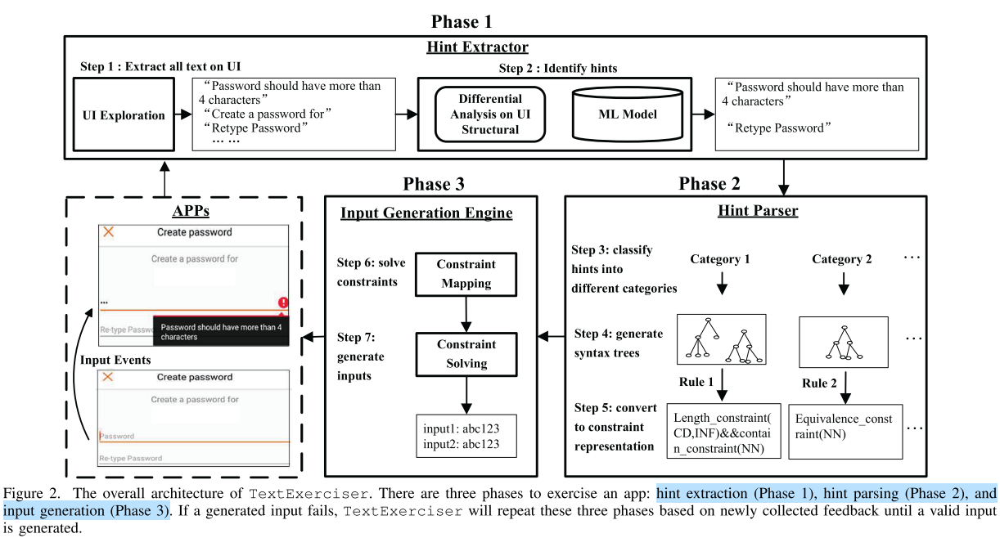

# TextExerciser: Feedback-driven Text Input Exercising for Android Applications

> S&P, 2020

## 简介

在安卓测试中，经常需要输入符合特定格式的文本（如注册、登录等）。然而，传统的测试工具（如Monkey等），普遍采用随机生成文本的方式，难以满足特定格式要求。

本文提出试验器TextExerciser，通过分析安卓应用提示（hints）自动生成文本约束，并通过约束求解的方法生成满足特定格式要求的文本。实验表明，较Monkey、DroidBot等工作在覆盖率层面有显著提升，并且发现了真实的隐患（leak）。

## 方法

方法主要分为3个部分，依次为提示抽取、提示解析、约束求解。

### 1. 提示抽取

提示抽取目标为从UI界面抽取提示文本，包括静态提示抽取、动态提示抽取、输入框匹配。

其中，静态提示为同输入框共同出现的文本，如输入密码时“需要包含大、小写字母和数字”的提示。为更精确获取此类文本，作者训练了二分类模型，以动态提示文本为正样本，输入无关页面文本为负样本。

动态提示包括文本变更，弹出窗口等多种形式。本文通过对比文本输入前后，页面布局的差异，来获取动态提示文本。

输入框匹配需要将上述静态、动态提示文本，同目标输入框配对，以便后续生成正确约束。本文结合关键字匹配、相对最短距离的方式完成匹配。

### 2. 提示解析。

提示解析完成从提示文本到约束（constraint）的建模。具体包含提示预分类、文本语法树生成、约束转换的过程。

提示预分类中，作者人工审核并标注了1200个安卓应用，将提示文本划分为4大类，10小类，18子类。并以此数据训练了一个基于CNN和RNN的多分类器。

文本语法树生成，过滤了不相关文本，并使用Stanford parser生成文本语法树。

约束转换，则将提示转换为形式化约束，此处主要考虑长度约束、内容约束、取值约束。

### 3. 约束求解。

约束求解，目标为依赖上述约束生成满足要求的文本。为满足注册需求，作者预先登记了部分邮箱、电话号码以便实验。随后，采用Z3StrSolver完成约束求解过程。

## 思考

### 1. 为何不用正则表达式作为约束？

正则表达式在识别邮箱、电话号码等方面有广泛应用。但该问题中，存在部分依赖上下文的约束，如注册时前后密码输入不一致等情况。因此，采用本文定义的约束覆盖更广阔的需求。

### 2. 开发者真的需要吗？

首先，本文工作在输入文本自动生成中颇有成效。但开发者真的需要这种工具吗？本文经历如此多环节，最终生成的约束以及满足约束的文本，可能开发者很容易就能写出脚本批量生成。真正阻碍开发者全面测试的隔阂（gap）在哪里呢？

此外，本文方法运行在生产环境中（学校做实验也没办法），导致很多环节是不可重复的。如，注册过程在某账号注册后，就无法用同样账号注册。同时，这种测试难免对生产环境的数据库造成污染。

当然，这些过程可以放在测试环境。但总觉得会有一些商业化、系统化的办法，能更全面、有序的测试一款应用。至少能够稳定的保证复发缺陷不会出现。

至于开发者真正需要怎样的技术，目前尚未工作的我仍无法想象。

### 3. 如何识别漏洞或隐患？

同之前Wuji文章一样，除了程序奔溃（Crash）、画面卡死等硬性情况，其他时候只能保证覆盖到了代码，但其中隐含的逻辑漏洞如何触发、识别呢？如本文图1中的例子，只是执行到可能不会发现，这类漏洞如何识别？不会是人工分析吧？

## 闲话

1. S&P，全称是IEEE Symposium on Security and Privacy，是计算机安全领域的顶级会议，普遍认为比ACM的CCS更受尊敬。由于其常年在Oakland召开，业内人士更喜欢称其为Oakland（据说2013年首次未在Oakland召开）。另有一说，是为了同杂志的S&P区分开。
